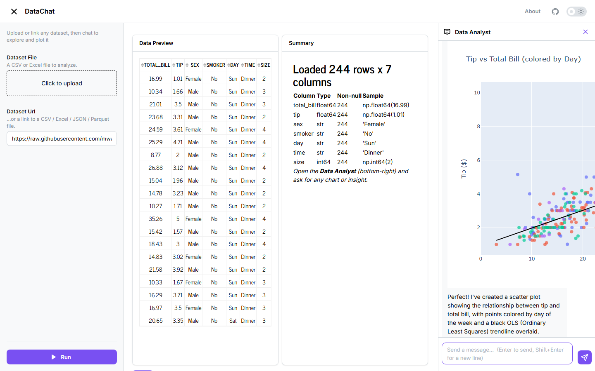

# DataChat

**Chat with any dataset — a data-analyst agent that writes and runs code to plot your answers. Built on [Fast Dash](https://github.com/dkedar7/fast_dash).**

Upload a CSV/Excel file (or paste a link to one), then ask the **Data Analyst** in the left sidebar: *"what drives sales?"*, *"plot tip vs total bill by day"*, *"show the correlation heatmap"*. The agent writes pandas/plotly code, runs it in a sandbox, and the resulting **charts and tables render inline in the chat**.



## How it works

- **Upload / link any dataset** → a normal Fast Dash app input decodes it to a DataFrame and shows a preview + summary.
- **The Data Analyst sidecar** is a **LangGraph + OpenRouter** agent with one tool: `run_analysis(code)`. It sees the schema, writes analysis code, and gets back the printed output (and any error) to reason over.
- **Charts render inline** — the agent's plotly figures and pandas tables stream through Fast Dash's built-in inline typed rendering (a `display_inline` extractor), so they appear as real interactive charts and sortable tables in the conversation.

The analyst runs on **Fast Dash 0.6.1**'s built-ins: the code runs in fast_dash's built-in sandbox (`fast_dash.sandbox.run_code`, originally upstreamed from this app) and the figures/tables render via fast_dash's inline typed rendering — so DataChat no longer ships its own sandbox or artifact-drain.

## Safety — the code runs sandboxed

LLM-written code executes in a **separate subprocess** (Fast Dash's built-in sandbox) with:
- a **scrubbed environment** (no API keys / tokens),
- **network disabled** (analysis runs on the provided DataFrame only),
- a **wall-clock timeout** and CPU/memory limits.

The DataFrame is injected into the child; it returns only a figure (JSON), a table, printed output, or an error.

## Run locally

```bash
uv sync
export OPENROUTER_API_KEY=...        # https://openrouter.ai/keys
uv run python -m app                 # http://127.0.0.1:8080
```

Optional: `DATACHAT_MODEL` (default `anthropic/claude-haiku-4.5`), `DATACHAT_MAX_ROWS`.

## Deploy

Served by gunicorn (gthread, single worker) so chat history and per-session data live in one process. See the `Dockerfile`; set `OPENROUTER_API_KEY` as a secret.

## Architecture

| File | Role |
| ---- | ---- |
| `app.py` | The upload/preview app + the Data Analyst sidecar |
| `analyst/agent.py` | LangGraph agent, `run_analysis` tool, inline figure/table rendering |
| `analyst/data.py` | Upload/URL loading + per-session DataFrame cache |

## Stack

Fast Dash (chat sidecar + built-in sandbox + inline typed rendering) · LangGraph · LangChain (OpenRouter) · pandas · plotly.

## License

MIT — see [LICENSE](LICENSE).
